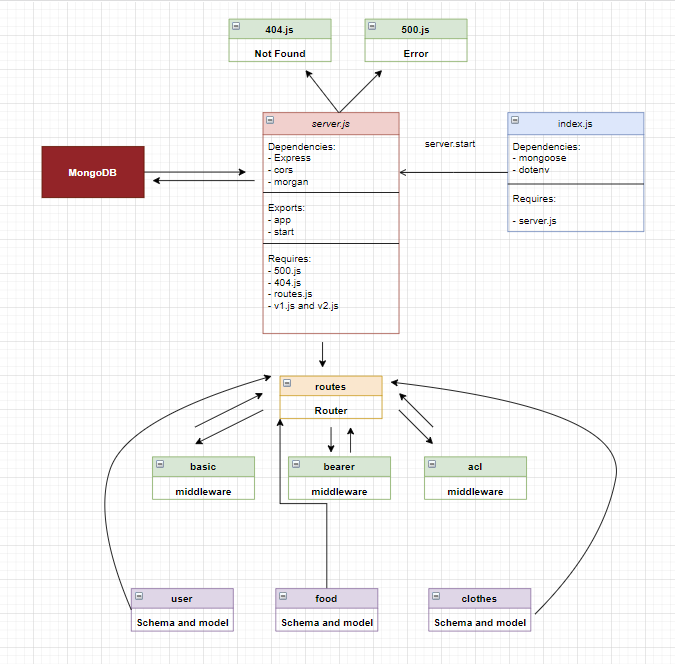

# auth-api

## Description

Task 1: Combine these 2 servers into a single server
Your server should respond to the following routes:
POST /signup to create a user
POST /signin to login a user and receive a token
GET /secret should require a valid bearer token
GET /users should require a valid token and “delete” permissions
NOTE: You will have some duplicated files and functionality between the 2 servers. Eliminate the waste and end with a single running server with all current routes functional

Task 2: Create a new set of “Protected” API routes
Restrict access without a valid token AND a specific capability.

Create a new set of routes (V2) within the server
V2 API Routes (/api/v2/...) must now be protected with the proper permissions based on user capability, using Bearer Authentication and an ACL
app.get(...) should require authentication only, no specific roles
app.post(...) should require both a bearer token and the create capability
app.put(...) should require both a bearer token and the update capability
app.patch(...) should require both a bearer token and the update capability
app.delete(...) should require both a bearer token and the delete capability
Task 3: Apply best practices and quality engineering
Full Test Coverage
Well executed UML and WRRC Diagrams
Polished and Complete Developer Friendly README.md at the root of your repo

## Links

Heroku Link: https://basic-auth-yazan.herokuapp.com/

Github Actions: https://github.com/yazantafesh/auth-api/actions

Pull Request: https://github.com/yazantafesh/basic-auth/pull/1

## UML

